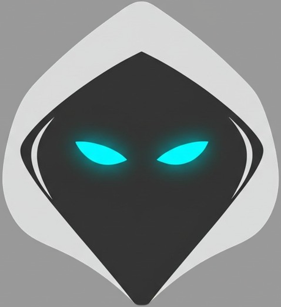
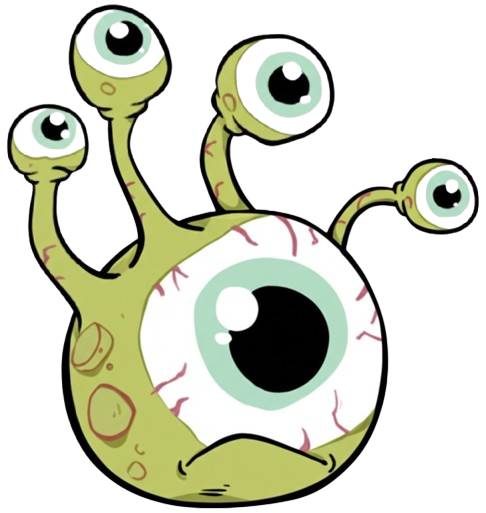

# 💀🔥 亡靈狂潮 · Undead Frenzy

**一款純前端 HTML5 波次生存遊戲。** 
扮演亡靈法師，召喚骷髏戰士、怨靈與眼魔，對抗無止盡的怪物浪潮。 
收集靈魂、強化召喚物，挑戰你的生存極限！

 

  

 

🎮 **遊戲網址** → <a href="https://pp771007.github.io/undead-frenzy-game/">https://pp771007.github.io/undead-frenzy-game/</a>

 

---

## ⚔️ 召喚單位

<table>
  <tr>
    <td align="center" width="33%">
       
      <b>骷髏戰士</b> 
      近戰 · 衝鋒撕咬
    </td>
    <td align="center" width="33%">
       
      <b>眼魔</b> 
      遠程 · 發射彈幕
    </td>
    <td align="center" width="33%">
       
      <b>怨靈</b> 
      範圍緩速 · 死亡爆炸
    </td>
  </tr>
</table>

 

## ✨ 主要特色

<table>
  <tr>
    <td>🧙‍♂️ <b>三種召喚單位</b></td>
    <td>骷髏戰士、眼魔、怨靈，各有獨特戰術定位</td>
  </tr>
  <tr>
    <td>⬆️ <b>升級系統</b></td>
    <td>各召喚物可分別升級血量、攻擊、技能範圍，價格遞增</td>
  </tr>
  <tr>
    <td>👻 <b>靈魂資源管理</b></td>
    <td>擊殺怪物獲得靈魂，用於召喚與升級</td>
  </tr>
  <tr>
    <td>🌊 <b>波次挑戰</b></td>
    <td>怪物數量與強度逐波提升，含基礎、快速、重甲三種敵人</td>
  </tr>
  <tr>
    <td>💾 <b>自動存檔</b></td>
    <td>每波結束自動儲存進度與設定，下次開啟自動讀取</td>
  </tr>
  <tr>
    <td>⏸️ <b>暫停選單</b></td>
    <td>可暫停、調整音量、查看召喚與擊殺統計</td>
  </tr>
  <tr>
    <td>👆 <b>長按連續操作</b></td>
    <td>召喚與升級按鈕支援長按快速連點</td>
  </tr>
  <tr>
    <td>📱 <b>觸控／滑鼠支援</b></td>
    <td>手機與電腦皆可流暢操作</td>
  </tr>
  <tr>
    <td>🎵 <b>背景音樂</b></td>
    <td>可於暫停選單調整音量</td>
  </tr>
</table>

 

## 🎮 遊玩方式

| 操作 | 說明 |
| :--- | :--- |
| **移動** | 在畫布區域按住滑鼠左鍵或手指拖曳，法師朝方向移動 |
| **召喚** | 點擊或長按下方召喚按鈕，消耗靈魂召喚單位 |
| **升級** | 點擊或長按升級按鈕，消耗靈魂提升該類召喚物等級 |
| **暫停／繼續** | 點擊上方「暫停」按鈕，暫停時可調整音量、重啟遊戲 |
| **統計資料** | 暫停選單查看各召喚物召喚數與怪物擊殺數 |
| **自動存檔** | 每波結束自動存檔，重新開啟會自動讀取 |
| **重啟遊戲** | 暫停選單或結束畫面可重啟，會清除存檔 |

 

## 🔧 技術棧

純前端、零依賴、開箱即玩。

`HTML5` &nbsp;·&nbsp; `CSS3` &nbsp;·&nbsp; `JavaScript（原生，無框架）`

 

---

> 遊戲完全在前端運作，無需安裝。 
> 直接開啟 <code>index.html</code>，或點擊上方按鈕線上遊玩 🎮

 

